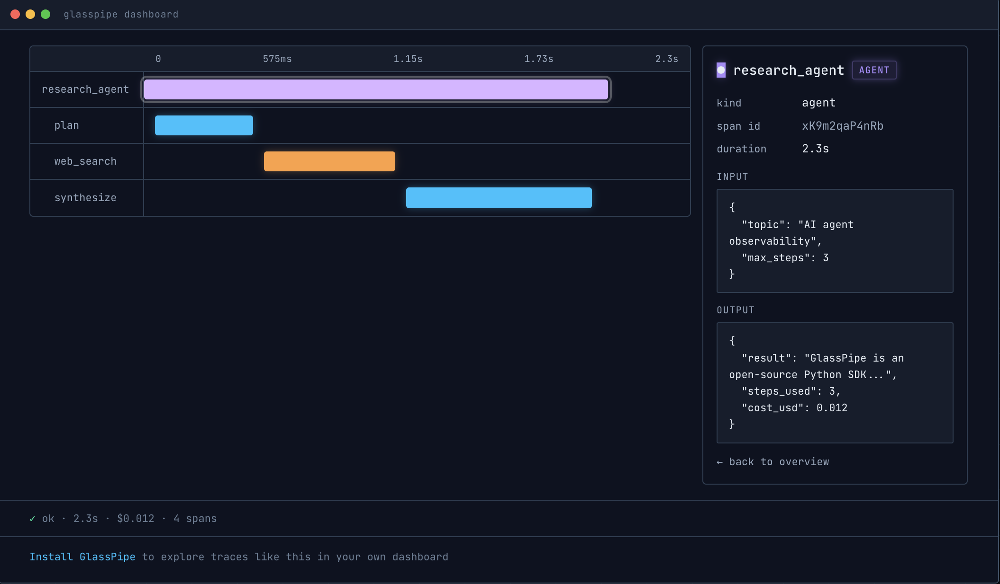

# GlassPipe — The Flight Recorder for AI Agents

**See what your AI agent actually did. Share the trace in one click.**

[](https://pypi.org/project/glasspipe/)
[](https://pypi.org/project/glasspipe/)
[](https://github.com/glasspipe/glasspipe/actions/workflows/tests.yml)
[](LICENSE)

```bash
pip install glasspipe
```



---

## The problem

You built an AI agent. It takes 47 seconds and costs $3 per run. You have no idea why.

The logs look like soup. You add print statements. You still don't know. You're flying blind.

GlassPipe fixes this in 60 seconds.

---

## How it works

Add one decorator:

```python
from glasspipe import trace

@trace
def my_agent(question):
    # your existing code, completely untouched
    return answer
```

Run your agent. Then:

```bash
glasspipe dashboard
```

Every LLM call, every tool, every step — captured and laid out as a visual timeline. Click any span to see exactly what went in and what came out. Share the whole trace with one click.

No agent handy? Seed realistic sample traces and explore:

```bash
glasspipe demo && glasspipe dashboard
```

**What you get:**

- **Waterfall timeline** — every span with duration, offset, and a click-through inspector
- **Cost & token tracking** — per-call and per-run, with live cost ticker for in-flight runs
- **Run diffing** — select two runs, see exactly which steps appeared, vanished, or slowed down
- **Agent versions** — tag runs with `@trace(version="v1.3.0")`, filter the run list by version
- **Anomaly watch** — flags suspected tool loops, cost spikes, and runaway step counts while a run is live
- **Trace replay** — replay a run's waterfall in real time
- **One-click sharing** — mandatory redaction preview, then a public link; no account, ever

---

## Install

```bash
pip install glasspipe
```

Requires Python 3.10+. No account. No API key. No configuration.

---

## Quickstart

```python
from glasspipe import trace, span

@trace
def research_agent(topic):
    # Manual spans for your own steps
    with span("plan", kind="custom") as s:
        plan = f"I will research: {topic}"
        s.record(input={"topic": topic}, output={"plan": plan})

    # Tool calls
    with span("web_search", kind="tool") as s:
        results = ["Result 1", "Result 2"]
        s.record(input={"query": topic}, output={"results": results})

    return results

research_agent("AI agent observability")
```

Then open the dashboard:

```bash
glasspipe dashboard
```

Your trace is waiting at `http://localhost:3000`.

---

## Auto-instrumentation

GlassPipe automatically records every OpenAI and Anthropic call — no extra code needed:

```python
import openai
from glasspipe import trace

@trace
def my_agent(question):
    # This call is automatically captured — model, tokens, cost, latency
    response = openai.chat.completions.create(
        model="gpt-4o",
        messages=[{"role": "user", "content": question}]
    )
    return response.choices[0].message.content
```

What gets captured automatically:
- Model name
- Prompt and completion tokens
- Cost in USD
- Latency
- Full input and output

---

## Sharing a trace

In the dashboard, click **Share** on any run.

A preview modal shows you exactly what will be made public. GlassPipe scans for secrets — API keys, tokens, emails, JWTs, credit cards — and auto-redacts every match before anything leaves your machine. Review the redacted preview, then confirm.

You get a link like:

```
https://glasspipe.dev/t/7sq3QX
```

Anyone can open it — [try that one](https://glasspipe.dev/t/7sq3QX), it's live. No account, ever. Traces expire after 30 days, and sharing gives you a delete token to revoke a trace early:

```bash
curl -X DELETE "https://glasspipe.dev/v1/trace/<id>?token=<delete-token>"
```

**Privacy guarantees:**

- Redaction happens on your machine, before upload. The server never sees the original data.
- The dashboard's share flow always routes through the redacted preview.
- Custom redaction patterns: set `GLASSPIPE_REDACT_PATTERNS` as a JSON dict in your environment.
- Shared traces are public but unlisted — accessible only by direct link.

---

## `[ EXAMPLES ]` Examples

Live shared traces (no install needed):

- [Competitive Intel Agent](https://glasspipe.dev/t/7sq3QX) — 8 spans: plan → analyze competitors → synthesize → draft brief → review
- [Support Agent](https://glasspipe.dev/t/TyvF6u) — 4 spans: classify → fetch → draft → review

Working examples in the [`/examples`](examples/) folder:

```bash
python examples/hello.py                    # minimal — two spans
python examples/research_agent.py           # 3 spans: plan, search, synthesize
python examples/customer_support.py         # 4 spans: classify, fetch, draft, review
python examples/competitive_intel_agent.py  # 8 spans with realistic token/cost data
```

All of the above run without an API key. There's also a before/after pair
(`live_customer_support_agent_*.py`) showing a real OpenAI-backed agent with
and without instrumentation — those two need `OPENAI_API_KEY`.

Or skip the files entirely: `glasspipe demo` seeds four sample runs, including
a failing one and two versions of the same agent so you can try run comparison
and version filtering.

---

## `[ COMPARE ]` GlassPipe vs Langfuse vs LangSmith

Honest comparison. Pick the right tool for the job.

|                           | GlassPipe      | Langfuse         | LangSmith        |
| ------------------------- | -------------- | ---------------- | ---------------- |
| Install time              | ~60 seconds    | ~20 minutes      | ~20 minutes      |
| Account required          | Never          | Yes              | Yes              |
| Public share in one click | Yes            | No               | No               |
| Local dashboard           | Yes            | No               | No               |
| Team workspaces           | No             | Yes              | Yes              |
| Production monitoring     | No             | Yes              | Yes              |
| Async support             | No             | Yes              | Yes              |
| Price                     | Free, OSS      | Free tier + paid | Free tier + paid |

---

## `[ LIMITS ]` What v1 doesn't do

We'd rather you know now than discover it ten minutes in. v1 is intentionally minimal. It does **not**:

- Support async Python (sync only — coming in v1.5)
- Capture streaming responses (final results only)
- Auto-instrument LangChain (raw OpenAI and Anthropic SDKs only)
- Support languages other than Python
- Provide team accounts, alerting, or production monitoring

If you need any of these today, use Langfuse, LangSmith, or Arize Phoenix. They're genuinely great tools.

---

## `[ DEV ]` Built with

Python 3.10+ · Flask · HTMX · SQLite · SQLAlchemy  
Hosted share service: Railway + Postgres

---

## `[ LIC ]` License

MIT. Free forever. See [LICENSE](LICENSE).

---

## `[ CTRB ]` Contributing

Issues and PRs welcome. This is v1 — there's plenty to improve.

- [Open an issue](https://github.com/glasspipe/glasspipe/issues)
- [Start a discussion](https://github.com/glasspipe/glasspipe/discussions)

---

Built by [Yonatan Michelson](https://www.linkedin.com/in/yonatan-michelson) · [glasspipe.dev](https://glasspipe.dev)
